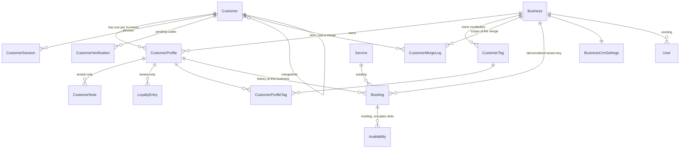
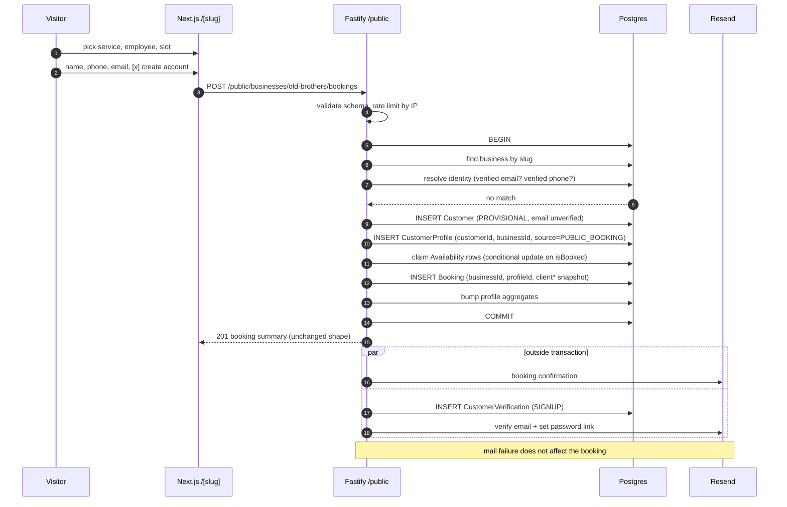
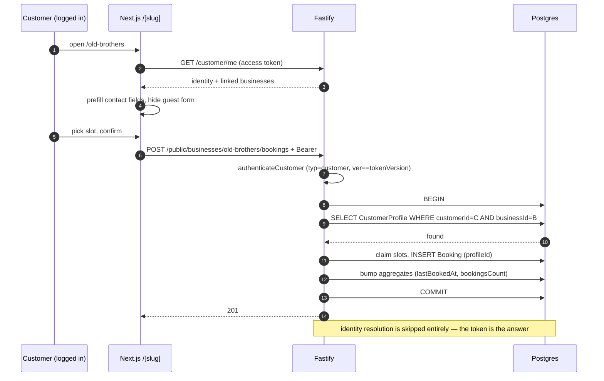
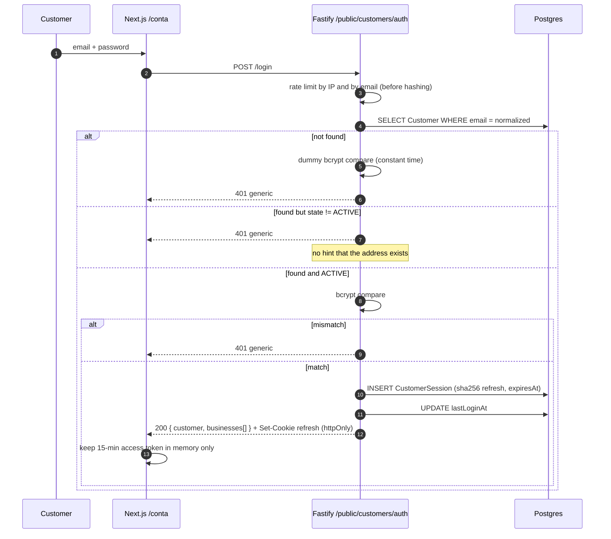

# Time Flow — CRM Architecture

**Status:** proposed
**Author:** lead architect
**Date:** 2026-07-30
**Scope:** promote customers to first-class entities with their own authentication, shared identity across businesses, and strictly per-business CRM data.
**Non-goal:** redesigning Business / User / Service / Availability / Booking / billing. Every change below is additive.

---

## 0. Executive summary

Today a "client" is three denormalized columns on `Booking` (`clientName`, `clientPhone`, `clientEmail`). There is no customer entity, no customer login, and no way for a business to see a client's history beyond scanning bookings.

The design introduces a two-layer identity model:

| Layer | Model | Owns | Visibility |
|---|---|---|---|
| **Global identity** | `Customer` | credentials, verified email/phone, global display name | the platform; a business sees only the fields it needs to serve the person |
| **Tenant record** | `CustomerProfile` | notes, loyalty, spend, counters, tags, status | exactly one business |

One `Customer` row per human. One `CustomerProfile` row per (human, business) pair. All CRM data hangs off `CustomerProfile`, never off `Customer`. The tenancy predicate for every CRM query is `CustomerProfile.businessId`, which is the same shape of guard the codebase already uses via `requireBusinessId`.

Three principles drive everything else:

1. **Identity is global, history is tenant-scoped.** No table other than `Customer`, `CustomerCredential`-adjacent tables, and `CustomerVerification` may be read without a `businessId` predicate.
2. **Only verified channels create identity links.** An unverified email is a claim, not an identity. This is not a nicety — the naive version is an account-takeover primitive (§13.1).
3. **Guest booking never breaks.** The existing `POST /public/businesses/:slug/bookings` contract keeps working byte-for-byte for anonymous callers. Authentication is an optional upgrade on the same endpoint.

---

## 1. Where this plugs into the current system

Facts about the code as it stands, because two of them materially constrain the design:

- `Booking` has **no `businessId`**. Tenancy is derived by joining `Booking -> Service -> Service.businessId`. Every CRM listing ("bookings this customer made here") would therefore need a join plus a filter on a column of another table — unindexable as a composite. **Phase 0 of the migration denormalizes `businessId` onto `Booking`.** This is required infrastructure for the CRM, not an optional cleanup.
- `Availability` is the row-volume hot spot (`@@unique([employeeId, date, startTime])`), and its `id` is `Int` (`int4`). At 100k businesses this overflows before the CRM tables get interesting (§16.4).
- The JWT payload is `{ sub, role, businessId }` and `authorize()` is an allow-list over the `Role` enum. **Customers must not enter that enum.** Adding `CUSTOMER` to `Role` turns every existing `authorize(...)` call site into a silent deny-list problem, and `businessId: null` already means "platform superadmin" in `requireBusinessId`. Customers get a separate token type and a separate middleware (§7.2).
- Input validation is JSON Schema with `additionalProperties: false` and `removeAdditional: true`. Every new schema follows that convention.
- The rate limiter is in-memory and per-process. Customer auth adds credential-stuffing and OTP-flood surface, which an in-process limiter cannot hold (§13.6).
- `Business.stripeCustomerId` is the **tenant's** Stripe customer. It has nothing to do with end customers. Do not let the CRM naming bleed into billing code.

---

## 2. Prisma schema

### 2.1 New enums

```prisma
enum CustomerIdentityState {
  /// Created by backfill or by a guest booking. No credentials, cannot log in.
  /// Exists so a business has a CRM record for a walk-in it only knows by phone.
  PROVISIONAL
  /// Has credentials and at least one verified channel.
  ACTIVE
  /// Self-service or support lock. Blocks login, does not hide history.
  SUSPENDED
  /// Right-to-erasure applied: PII scrubbed, row kept to preserve FKs.
  ERASED
}

enum CustomerProfileStatus {
  ACTIVE
  /// This business refuses new bookings from this person. Tenant-local.
  BLOCKED
}

enum VerificationChannel {
  EMAIL
  PHONE
}

enum VerificationPurpose {
  SIGNUP
  LOGIN
  ADD_CHANNEL
  CLAIM_HISTORY
  PASSWORD_RESET
}

enum LoyaltyEntryKind {
  /// Automatic accrual from a completed booking.
  EARN
  /// Redemption against a booking or a reward.
  REDEEM
  /// Manual correction by staff. Always carries an authorId and a reason.
  ADJUST
  /// Points invalidated by policy (expiry window).
  EXPIRE
}

enum CustomerLinkSource {
  /// Linked by booking on the public page.
  PUBLIC_BOOKING
  /// Created by staff in the dashboard.
  STAFF
  /// Produced by the historical backfill.
  MIGRATION
  /// Customer explicitly claimed pre-existing guest history.
  CLAIM
}

/// Who caused a merge. Added during phase 1: §4.3 specified an "actor" without
/// saying what shape it takes, and the three triggers of a merge are genuinely
/// different parties.
enum CustomerMergeActor {
  /// Claim flow — the customer proved the history is theirs.
  CUSTOMER
  /// Support or an admin resolving a duplicate by hand.
  STAFF
  /// Migration job.
  SYSTEM
}
```

### 2.2 Global identity

```prisma
/// The person. One row per human across the whole platform.
/// Holds no business data of any kind — that is CustomerProfile's job.
model Customer {
  id        Int      @id @default(autoincrement())
  createdAt DateTime @default(now())
  updatedAt DateTime @updatedAt

  /// Opaque handle for the customer-facing portal. The integer id never
  /// leaves the server: it is guessable and would let anyone enumerate the
  /// platform's customer count.
  /// Defaulted in the DATABASE rather than by Prisma's `uuid()`, so that every
  /// insertion path gets one — including the phase 3 backfill, which may have
  /// to be raw SQL at volume. Also 16 bytes instead of 36, which matters on a
  /// unique index over tens of millions of rows.
  publicId String @db.Uuid @unique @default(dbgenerated("gen_random_uuid()"))

  state CustomerIdentityState @default(PROVISIONAL)

  /// Global display name. A per-business override lives on CustomerProfile,
  /// so changing this never rewrites what a business already knows.
  name String

  /// Nullable because a PROVISIONAL row created from a phone-only walk-in has
  /// no email. Unique globally: exactly one identity may claim an address.
  /// Being present does NOT mean verified — see emailVerifiedAt.
  email           String?   @unique
  emailVerifiedAt DateTime?

  /// E.164, normalized on write. Same claim-vs-verified split as email.
  phoneE164       String?   @unique
  phoneVerifiedAt DateTime?

  /// Null for PROVISIONAL identities: they cannot log in by construction.
  passwordHash String?

  /// Bumped on password change, credential revocation, and erasure. Access
  /// tokens carrying a lower value are rejected without a DB lookup of the
  /// session, which is what makes short-lived stateless access tokens safe.
  tokenVersion Int @default(0)

  /// Set when this row was merged into another identity (§4.3). Kept instead
  /// of deleted so old refresh tokens and audit rows still resolve.
  mergedIntoId Int?
  mergedInto   Customer?  @relation("CustomerMerge", fields: [mergedIntoId], references: [id])
  mergedFrom   Customer[] @relation("CustomerMerge")

  lastLoginAt DateTime?

  profiles      CustomerProfile[]
  sessions      CustomerSession[]
  verifications CustomerVerification[]

  @@index([state])
  @@index([mergedIntoId])
}
```

> **Partial uniqueness.** Prisma cannot express `UNIQUE ... WHERE verified_at IS NOT NULL`. The `@unique` above is a full unique constraint, which is the behaviour we want (one claim per address), combined with an application rule that only verified channels participate in linking, plus a reclaim procedure for squatted unverified claims (§4.2). No partial index needed; if the reclaim rule is later relaxed, the correct tool is a raw-SQL partial index in the migration, not a Prisma-level change.

```prisma
/// Refresh-token family for one device. The token itself is never stored.
model CustomerSession {
  /// BigInt from birth: refresh rotation writes one row per rotation, which is
  /// ~5e8 rows/year at 100k businesses — int4 overflows in about four years
  /// (§14.1). Safe to make BigInt here precisely because this id never crosses
  /// the wire: the API addresses sessions by publicId, so no DTO ever has to
  /// serialize a bigint.
  id        BigInt   @id @default(autoincrement())
  publicId  String   @db.Uuid @unique @default(dbgenerated("gen_random_uuid()"))
  createdAt DateTime @default(now())

  customer   Customer @relation(fields: [customerId], references: [id])
  customerId Int

  /// SHA-256 of the refresh token, same reasoning as User.passwordResetTokenHash:
  /// the raw value is a bearer credential, so a DB leak must not yield usable tokens.
  refreshTokenHash String   @unique
  expiresAt        DateTime

  /// Rotation chain. On refresh the old row is revoked and a new one points
  /// back at it, so replay of a rotated token is detectable and revokes the
  /// whole family.
  replacedById BigInt?           @unique
  replacedBy   CustomerSession?  @relation("SessionRotation", fields: [replacedById], references: [id])
  replaces     CustomerSession?  @relation("SessionRotation")

  revokedAt DateTime?

  /// Coarse device attribution for the "your sessions" screen. Truncated
  /// user-agent and /24-masked IP: enough to recognize a device, not a
  /// tracking log.
  userAgent String?
  ipPrefix  String?

  @@index([customerId, revokedAt])
  @@index([expiresAt])
}

/// One-time codes and links: email verification, phone OTP, magic-link login,
/// password reset, history claim.
model CustomerVerification {
  /// BigInt for the same churn reason as CustomerSession, and safe for the same
  /// reason: a verification row is never addressed by id from outside — the
  /// caller presents a code, which is looked up by hash.
  id        BigInt   @id @default(autoincrement())
  createdAt DateTime @default(now())

  customer   Customer @relation(fields: [customerId], references: [id])
  customerId Int

  channel VerificationChannel
  purpose VerificationPurpose

  /// The channel value this code was sent to, captured at send time. Needed
  /// because the customer may change email before redeeming, and a code must
  /// only ever validate the destination it was actually mailed to.
  destination String

  /// SHA-256 of the code/token. A 6-digit OTP is low-entropy, so the hash is
  /// a defence-in-depth measure, not the primary control — attempts and
  /// expiry are (§13.3).
  codeHash String

  expiresAt   DateTime
  consumedAt  DateTime?
  attempts    Int       @default(0)

  /// Set for CLAIM_HISTORY: which business's guest records this code unlocks.
  /// Null for every other purpose.
  businessId Int?
  business   Business? @relation(fields: [businessId], references: [id])

  @@index([customerId, purpose, consumedAt])
  @@index([expiresAt])
}
```

### 2.3 Tenant-scoped CRM

```prisma
/// The CRM record: this person, at this business. Every piece of customer
/// data a business owns hangs off here. This is the row the tenancy guard
/// checks, and the only customer-shaped object the dashboard ever sees.
model CustomerProfile {
  id        Int      @id @default(autoincrement())
  createdAt DateTime @default(now())
  updatedAt DateTime @updatedAt

  /// What the dashboard and the business-facing API use as the customer's id.
  /// Deliberately not Customer.id: if two businesses both received the global
  /// id they could compare notes and discover shared clients, which is
  /// exactly the correlation we promise does not happen.
  publicId String @db.Uuid @unique @default(dbgenerated("gen_random_uuid()"))

  customer   Customer @relation(fields: [customerId], references: [id])
  customerId Int

  business   Business @relation(fields: [businessId], references: [id])
  businessId Int

  source CustomerLinkSource
  status CustomerProfileStatus @default(ACTIVE)

  /// Name/phone/email as this business knows them. Seeded from Customer at
  /// link time, editable by staff, never overwritten by a global change.
  /// This is what makes "businesses never share history" true for PII too:
  /// a customer renaming themselves at Barber Prime does not rename them at
  /// Old Brothers.
  displayName  String
  displayPhone String?
  displayEmail String?

  /// Cached aggregates. Source of truth is Booking / LoyaltyEntry; these are
  /// maintained in the same transaction as the event that changes them and
  /// are re-derivable by a reconciliation job (§15.2).
  bookingsCount     Int      @default(0)
  completedCount    Int      @default(0)
  noShowCount       Int      @default(0)
  canceledCount     Int      @default(0)
  totalSpent        Decimal  @default(0) @db.Decimal(12, 2)
  /// True when any booking contributing to totalSpent predates phase 0 and so
  /// has no priceAtBooking snapshot. Stored rather than derived: otherwise every
  /// reporting query would have to re-ask "does this profile have a null
  /// snapshot anywhere", and the UI could not label the number honestly.
  spendIsEstimated  Boolean  @default(false)
  loyaltyPoints     Int      @default(0)
  firstBookedAt     DateTime?
  lastBookedAt      DateTime?

  bookings Booking[]
  notes    CustomerNote[]
  loyalty  LoyaltyEntry[]
  tags     CustomerProfileTag[]

  /// One CRM record per person per business. This is the anti-duplication
  /// invariant, enforced by the database rather than by a service check.
  @@unique([customerId, businessId])
  /// Default dashboard listing: most recently active first.
  @@index([businessId, lastBookedAt(sort: Desc)])
  @@index([businessId, status, displayName])
  @@index([businessId, createdAt])
}

/// Free-text staff note. Tenant-scoped by construction: businessId is stored
/// here, not inferred through the profile, so the guard is a single predicate.
model CustomerNote {
  id        Int      @id @default(autoincrement())
  createdAt DateTime @default(now())
  updatedAt DateTime @updatedAt

  profile   CustomerProfile @relation(fields: [profileId], references: [id], onDelete: Cascade)
  profileId Int

  business   Business @relation(fields: [businessId], references: [id])
  businessId Int

  /// Nullable: the author may be deleted (offboarded employee) while the
  /// note stays as business record.
  author   User? @relation(fields: [authorId], references: [id])
  authorId Int?

  body String @db.Text

  /// Notes are never shown to the customer. Kept as an explicit column
  /// anyway, so a future "share with customer" feature cannot leak the
  /// existing corpus by changing a query.
  visibleToCustomer Boolean @default(false)

  @@index([profileId, createdAt(sort: Desc)])
  @@index([businessId, createdAt(sort: Desc)])
}

/// Tag vocabulary, owned by one business. "VIP" at Old Brothers and "VIP" at
/// Barber Prime are different rows and must be.
model CustomerTag {
  id        Int      @id @default(autoincrement())
  createdAt DateTime @default(now())

  business   Business @relation(fields: [businessId], references: [id])
  businessId Int

  name  String
  /// Hex, validated in rules. Presentation only.
  color String?

  profiles CustomerProfileTag[]

  @@unique([businessId, name])
}

model CustomerProfileTag {
  profile   CustomerProfile @relation(fields: [profileId], references: [id], onDelete: Cascade)
  profileId Int

  tag   CustomerTag @relation(fields: [tagId], references: [id], onDelete: Cascade)
  tagId Int

  createdAt DateTime @default(now())

  @@id([profileId, tagId])
  @@index([tagId])
}

/// Append-only points ledger. Balance is a cached sum on CustomerProfile;
/// this table is the audit trail and the thing a dispute is resolved against.
/// Rows are never updated or deleted — a mistake is corrected with an ADJUST.
model LoyaltyEntry {
  id        Int      @id @default(autoincrement())
  createdAt DateTime @default(now())

  profile   CustomerProfile @relation(fields: [profileId], references: [id])
  profileId Int

  business   Business @relation(fields: [businessId], references: [id])
  businessId Int

  kind LoyaltyEntryKind
  /// Signed. EARN/ADJUST positive or negative, REDEEM/EXPIRE negative.
  /// Integer points: fractional loyalty points are a support ticket, not a feature.
  points Int

  /// The booking that generated the accrual, when there is one.
  booking   Booking? @relation(fields: [bookingId], references: [id])
  bookingId Int?

  /// Required for ADJUST by the rules layer; free-form otherwise.
  reason String?

  author   User? @relation(fields: [authorId], references: [id])
  authorId Int?

  /// Makes accrual idempotent: a webhook retry or a double-clicked
  /// "complete booking" cannot double-award. Scoped per business.
  idempotencyKey String?

  @@unique([businessId, idempotencyKey])
  @@index([profileId, createdAt(sort: Desc)])
  @@index([businessId, kind, createdAt])
}

/// Audit trail of the only destructive operation in the CRM. Specified in §4.3
/// and required by §11.10; the Prisma model was missing from this section and
/// was written in phase 1.
///
/// One row per (merge, business) pair: the merge walks the loser's profiles one
/// business at a time, and per-business is the granularity support needs.
model CustomerMergeLog {
  id        Int      @id @default(autoincrement())
  createdAt DateTime @default(now())

  winner   Customer @relation("MergeWinner", fields: [winnerId], references: [id])
  winnerId Int

  loser   Customer @relation("MergeLoser", fields: [loserId], references: [id])
  loserId Int

  business   Business @relation(fields: [businessId], references: [id])
  businessId Int

  /// §4.3 said "movedCounts" without fixing a representation. Explicit columns
  /// rather than Json: support filters and sums these, and a blob would be an
  /// undeclared schema inside a declared one.
  movedBookings Int @default(0)
  movedNotes    Int @default(0)
  movedLoyalty  Int @default(0)
  /// True when the winner ALREADY had a profile at this business and the two had
  /// to be collapsed into one — the genuinely destructive case, where the
  /// loser's profile stopped existing.
  profilesCollapsed Boolean @default(false)

  actor CustomerMergeActor
  /// Set only when actor = STAFF.
  actorUser   User? @relation(fields: [actorUserId], references: [id])
  actorUserId Int?

  @@index([winnerId, createdAt(sort: Desc)])
  @@index([loserId])
  @@index([businessId, createdAt(sort: Desc)])
}
```

**Append-only is enforced by the database, not by convention.** A `BEFORE UPDATE OR DELETE ... FOR EACH ROW` trigger on `CustomerMergeLog` raises `restrict_violation`. The repository layer also exposes no update or delete method, but a merge bug is unrecoverable without this log (§11.10), so the guarantee cannot rest on a future contributor remembering the rule. Two implementation notes: the trigger is deliberately row-level, because `TRUNCATE` does not fire row-level triggers and `TRUNCATE` is how the integration suite resets that table — the lock protects against application bugs without making the harness untestable. And Prisma manages neither functions nor triggers, so this produces no schema drift and survives later migrations (verified: `prisma migrate diff` reports an empty migration after applying it).

### 2.4 Additive changes to existing models

Only the new lines are shown; nothing existing is removed or retyped.

```prisma
model Business {
  // ... unchanged ...

  customerProfiles CustomerProfile[]
  customerNotes    CustomerNote[]
  customerTags     CustomerTag[]
  loyaltyEntries   LoyaltyEntry[]
  verifications    CustomerVerification[]
  bookings         Booking[]

  /// Per-tenant CRM configuration. Separate row rather than more columns on
  /// Business: the CRM is optional and its settings will keep growing.
  crmSettings BusinessCrmSettings?
}

model User {
  // ... unchanged ...

  customerNotes  CustomerNote[]
  loyaltyEntries LoyaltyEntry[]
}

model Booking {
  // ... clientName / clientPhone / clientEmail / source unchanged ...

  /// Denormalized tenant key. Previously derived through Service.businessId,
  /// which cannot participate in a composite index with a date. Added in
  /// migration phase 0 and backfilled; nullable only until the backfill is
  /// verified, then NOT NULL.
  business   Business? @relation(fields: [businessId], references: [id])
  businessId Int?

  /// Null for every pre-CRM booking and for guests who gave no contact
  /// channel. The client* columns above stay as the immutable "as booked"
  /// snapshot — they are the record of what the customer actually typed, and
  /// must not be rewritten when the profile is later edited.
  profile   CustomerProfile? @relation(fields: [profileId], references: [id])
  profileId Int?

  loyaltyEntries LoyaltyEntry[]

  /// Client-supplied de-dup key for the public booking POST. Stops a
  /// double-tap on a flaky mobile connection from creating two bookings and
  /// two loyalty accruals.
  idempotencyKey String?

  @@unique([businessId, idempotencyKey])
  @@index([businessId, createdAt(sort: Desc)])
  @@index([profileId, createdAt(sort: Desc)])
}

/// Tenant-level CRM knobs.
model BusinessCrmSettings {
  businessId Int      @id
  business   Business @relation(fields: [businessId], references: [id])

  createdAt DateTime @default(now())
  updatedAt DateTime @updatedAt

  loyaltyEnabled Boolean @default(false)
  /// Points granted per whole currency unit of a completed booking.
  pointsPerUnit  Int     @default(1)
  /// Null = points never expire.
  pointsExpireAfterDays Int?
  /// Whether the public page offers "log in to book faster".
  customerLoginEnabled  Boolean @default(true)
}
```

---

## 3. Relationships



The important reading of that diagram: there is exactly one edge from the global layer into the tenant layer, `Customer -> CustomerProfile`, and it is traversed in only one direction at runtime. Business-facing code starts at `businessId` and never walks up to `Customer` except to read the shared identity fields it is entitled to. Customer-facing code starts at `customerId` and fans out to profiles, but the portal only ever renders one business's data at a time.

### 3.1 The isolation invariant, stated precisely

For any request authenticated as `User` with `businessId = B`:

> every row of `CustomerProfile`, `CustomerNote`, `LoyaltyEntry`, `CustomerTag`, `Booking` reachable by that request satisfies `row.businessId = B`.

For any request authenticated as `Customer` with `customerId = C` scoped to business `B`:

> every row reachable satisfies `businessId = B AND` (directly or through `CustomerProfile`) `customerId = C`.

Enforcement, in order of reliability:

1. **Schema.** `businessId` is stored on every tenant-scoped table, including the ones where it is technically derivable. Derivable is not the same as cheap or safe.
2. **Repository layer.** Repositories for CRM tables take `businessId` as a **required first positional argument**. There is no `findById(id)` for a CRM row. This mirrors the existing `createBookingForBusiness(business.id, ...)` shape.
3. **Route surface.** The business-facing API addresses customers by `CustomerProfile.publicId`, which is meaningless without the tenant scope, so a leaked identifier is not a cross-tenant key.
4. **Optional, later.** Postgres RLS with a session variable set per request. Worth it if the team ever runs analytical queries outside the repository layer; overkill while Prisma is the only client (§16.6).

---

## 4. Identity resolution and de-duplication

This is the load-bearing part of the design. Everything else is bookkeeping.

### 4.1 The rule

An inbound booking or signup carries some subset of `{email, phone, password}`. Resolution:

```
normalize email  -> lowercase, trim
normalize phone  -> E.164 using the business's country as default region;
                    reject if unparseable (do not store a partial number)

1. If the request is authenticated as a Customer -> use that identity. Done.
2. Look for an ACTIVE Customer whose emailVerifiedAt IS NOT NULL and email matches.
   Found -> link to it.
3. Look for an ACTIVE Customer whose phoneVerifiedAt IS NOT NULL and phoneE164 matches.
   Found -> link to it.
4. Look for a PROVISIONAL Customer already linked to THIS business with a
   matching email or phone.
   Found -> reuse it (this is the same walk-in coming back).
5. Otherwise create a new PROVISIONAL Customer.
```

Steps 2 and 3 are the only cross-business joins in the system, and they are gated on verification. Step 4 is deliberately scoped to the current business: two unverified guest records with the same typed email at two different businesses stay separate identities until somebody proves ownership of that email.

### 4.2 Unverified claims and reclaim

`Customer.email` and `Customer.phoneE164` are globally unique even when unverified, so an unverified row squats the address. Two consequences and their handling:

- **A guest booking may fail to store an email** because a PROVISIONAL row elsewhere already claims it. Handling: the booking still succeeds — `Booking.clientEmail` records what was typed, and the new PROVISIONAL customer is created with `email = null` and a pending claim. The address is not lost; it is just not an identity key yet.
- **Squatting.** Whoever verifies the address wins it. When a customer verifies `davi@x.com` and a different PROVISIONAL row holds that email, the verification transaction nulls the loser's `email` (the value survives on `CustomerProfile.displayEmail` and on the `Booking` snapshot, so no business loses data) and then runs the merge of §4.3 if the loser is linked to a business the winner is also linked to. Verified always beats unverified; verified-vs-verified is impossible because verification is what makes it unique.

### 4.3 Merge-on-verify

Merging is how backfilled and guest history becomes reachable by a real login, and it is the only operation that touches two identities.

Given winner `W` (ACTIVE, verified) and loser `L` (PROVISIONAL), inside one transaction:

1. For each `CustomerProfile` of `L` at business `B`:
   - if `W` has no profile at `B` — repoint `profileId.customerId = W.id`; keep every aggregate, note, loyalty entry and booking exactly as it is;
   - if `W` already has a profile at `B` — this is the only genuinely destructive case. Move bookings, notes and loyalty entries onto `W`'s profile, recompute the aggregates from the moved rows, then delete `L`'s profile. Record the operation in an append-only `CustomerMergeLog` (id, winnerId, loserId, businessId, movedCounts, actor, at) so the merge is reversible by hand.
2. Set `L.state = ERASED`-adjacent bookkeeping: `L.mergedIntoId = W.id`, `L.email = null`, `L.phoneE164 = null`, `L.passwordHash = null`, `L.tokenVersion += 1`.
3. Revoke all of `L`'s sessions.

Merges are never automatic across businesses without a verified channel, never triggered by staff editing a `displayEmail`, and never batched. One verification, one merge, one log row.

### 4.4 What a business can and cannot learn

| Field | Business sees | Why |
|---|---|---|
| `CustomerProfile.displayName/Phone/Email` | yes | needed to serve and contact the person |
| `CustomerProfile.publicId` | yes | its handle for the record |
| `Customer.id`, `Customer.publicId` | **no** | shared across tenants; two businesses could correlate clients |
| `Customer.state` | no (surfaced only as a boolean "conta verificada") | reveals platform-level facts |
| other businesses' profiles, bookings, notes, points | no | the whole point |
| "this customer also uses other businesses" | no, not even as a count | a count is a side channel; a competitor learns retention |

The reverse direction matters too: the customer portal shows the customer their own history **per business**, and must not present a business's internal notes or tags. `CustomerNote.visibleToCustomer` exists so that a future feature cannot flip the default for the existing corpus.

---

## 5. Authentication flow

### 5.1 Credential model

- **Primary:** email + password. Matches what already exists for `User` (bcrypt via `lib/password.ts`, Resend for delivery) and needs no new vendor.
- **Secondary:** email magic link / 6-digit code. Same `CustomerVerification` machinery. Recommended as the default CTA on the public page, because a first-time booker will not create a password mid-booking.
- **Phone OTP:** schema-ready, **not shippable in v1**. There is no SMS provider in the stack. Verified-phone de-duplication (§4.1 step 3) is therefore dead code until Twilio/Zenvia is added and budgeted. Ship email-verified de-dup first; phone matching is a config flag away once the provider exists. This is called out rather than hidden because requirement 4 says "email **or verified phone**" and only half of it is deliverable now.
- **OAuth (Google/Apple):** deliberately out of scope; the extension point is a `CustomerAuthMethod` table (customerId, provider, providerSubject, unique on the pair) that would be added additively. Nothing in this design blocks it.

### 5.2 Token design

Two token types, one signing key, disjoint namespaces.

| | Staff token (existing) | Customer token (new) |
|---|---|---|
| claims | `{ sub, role, businessId }` | `{ sub, typ: "customer", ver }` |
| lifetime | as today | 15 min access + 30 day rotating refresh |
| transport | as today | access in memory, refresh in `httpOnly; Secure; SameSite=Lax` cookie |
| middleware | `authenticate` + `authorize(...)` | `authenticateCustomer` |

Hard rules:

- `authenticateCustomer` **rejects** any token without `typ === "customer"`, and the existing `authenticate` **rejects** any token *with* it. Both checks are explicit. A single missing check here is a full privilege escalation, so it is asserted in tests from both directions.
- No `businessId` in the customer token, ever. The customer's tenant set is unbounded and mutable; a token that carried it would be stale the moment they book somewhere new, and would grow without limit. Tenant scope comes from the route path and is authorized by loading the `CustomerProfile` row.
- `ver` is compared against `Customer.tokenVersion`. Password change, merge, suspension and erasure all bump it, which invalidates every outstanding access token without a session lookup on the hot path.
- Refresh rotation with reuse detection: presenting an already-rotated refresh token revokes the entire session family and forces re-login. Cheap, and the only real defence against a stolen cookie.

`Role` is untouched. `JwtPayload` gains a sibling interface rather than optional fields, so TypeScript makes the distinction non-optional at every call site.

### 5.3 Login sequence, in words

1. `POST /customer/auth/login { email, password }`.
2. Constant-time comparison; a missing customer runs a dummy hash so timing does not leak existence.
3. `state !== ACTIVE` — generic failure. A PROVISIONAL row must not answer "this account exists but has no password", because that would confirm the email books somewhere.
4. Issue access + refresh; create `CustomerSession`; set cookie; bump `lastLoginAt`.
5. Response contains the customer's own identity and the list of businesses they are linked to (slug, name, logo) — that list is *theirs*, not a business's, so it is not a cross-tenant leak.

Failure responses are uniform: `401` with one message for wrong password, unknown email, suspended and unverified. The differentiating information goes into the email channel, not the HTTP response.

---

## 6. Registration flow

Three entry points, one resolution function (§4.1).

**A. Booking-time (dominant path).** The guest fills the existing form. If they tick "create my account", the booking transaction creates a PROVISIONAL customer, links the profile, creates the booking, and enqueues a `SIGNUP` verification email. Verification promotes to ACTIVE and sets a password. **The booking never waits on the email.** A failed send degrades to a guest booking with a claimable record, not a lost appointment.

**B. Portal signup.** `POST /customer/auth/register { name, email, password }` — always returns `202` with the same body whether or not the email is already taken (§13.2). If taken and verified, the email sent is "someone tried to register with your address, here is a login link". If taken and unverified, it is a normal verification. No branch is observable from the response.

**C. Claim.** An existing customer logs in and the portal offers "we found bookings at Old Brothers under this email/phone — is that you?". Confirming sends a `CLAIM_HISTORY` code scoped to that `businessId`; redeeming runs the merge of §4.3. Claims are per-business and never bulk-confirmed, so one wrongly typed email cannot hand over four businesses' history.

Rate limits per email and per IP on all three, with the counter incremented **before** the expensive work (hash, mail send).

---

## 7. Public booking flow

The endpoint stays `POST /public/businesses/:slug/bookings`. It gains an optional `Authorization` header and three optional body fields (`createAccount`, `idempotencyKey`, and a nullable `profilePublicId` for staff-side use on the internal path). The existing required fields stay required for anonymous callers. An old client keeps working with zero changes — that is the backward-compatibility contract.

Three cases:

| Caller | Behaviour |
|---|---|
| **Anonymous, no email** | exactly today's behaviour, plus a PROVISIONAL customer + profile keyed on the normalized phone so the business gets a CRM record. `Booking.profileId` set. |
| **Anonymous, with email** | as above, resolution per §4.1; if the email belongs to a verified ACTIVE customer, the booking links to **their** profile at this business (creating the profile if needed). The booking confirmation email mentions the account; the guest is not logged in and sees nothing extra. |
| **Authenticated customer** | identity comes from the token, contact fields are pre-filled and may be overridden per booking. If no `CustomerProfile` exists for this business, one is created with `source = PUBLIC_BOOKING` — **this is the "linking a business" operation, and it is implicit.** No consent screen, because the customer is voluntarily booking there; what needs consent is data flowing the other way, and none does. |

Transaction boundary, extending the existing race-safe slot claim rather than replacing it:

```
BEGIN
  resolve/create Customer            (may be a no-op)
  upsert CustomerProfile             (unique [customerId, businessId] absorbs the race)
  claim Availability rows            (existing conditional update on isBooked — unchanged)
  insert Booking                     (+ businessId, profileId, idempotencyKey)
  bump profile aggregates            (bookingsCount, firstBookedAt, lastBookedAt)
COMMIT
then, outside the transaction: confirmation email, loyalty accrual job
```

Two ordering notes that matter. The slot claim stays the **last** thing that can fail for a business reason, so identity work is never the cause of a lost slot. And loyalty accrual happens on **completion**, not creation — awarding points at booking time pays out no-shows.

Concurrency: two simultaneous first-time bookings by the same customer at the same business race on `@@unique([customerId, businessId])`; the loser retries the upsert and proceeds. Standard, and the constraint means the failure mode is a retry rather than a duplicate.

---

## 8. Migration strategy

Expand/contract, six phases, each independently deployable and revertible. `PRD.md`/`TASKS.md` conventions apply: pause between phases.

**Phase 0 — `Booking.businessId` (prerequisite, no CRM yet). — SHIPPED 2026-07-30**
Add nullable column + FK + `@@index([businessId, createdAt])`. Backfill `UPDATE booking SET business_id = service.business_id`. Write path sets it explicitly in `createBookingForBusiness`, which already receives `businessId`. Verify with `SELECT count(*) FROM booking b JOIN service s ON s.id=b.service_id WHERE b.business_id IS DISTINCT FROM s.business_id` returning 0, then set NOT NULL in a follow-up migration. Existing reads keep joining through `Service`; nothing depends on the new column yet.
*Rollback:* drop column. Zero behavioural change.

> Migration `20260730050756_add_business_id_and_price_to_booking`, hand-written for the backfill. Also added `Booking.priceAtBooking` (decision 2, approved). Index created with `IF NOT EXISTS` so that at production volume it can be pre-created `CONCURRENTLY` out-of-band and this step becomes a no-op — Prisma wraps each migration file in a transaction, and `CREATE INDEX CONCURRENTLY` cannot run inside one. Verified on the development database: 177 bookings, 177 with a tenant key, 0 divergent from `Service.businessId`. `priceAtBooking` is intentionally *not* backfilled — a value copied from today's `Service.price` would be indistinguishable from a real snapshot, so null is the honest answer. Tests: 3 added (tenant + price on the public path, on the internal path, and a price-increase test proving the snapshot does not follow the reajuste). Suite after: 165 unit, 54 integration, all passing.

**Phase 1 — tables only. — SHIPPED 2026-07-30**
All new models, no writes, no routes. Deploy is a pure DDL migration. Verifies index creation cost and migration duration against production-size data.
*Rollback:* drop tables.

> Migration `20260730051747_add_crm_schema`: 6 enums + `CustomerMergeActor`, 9 tables, 27 indexes, and three nullable columns on `Booking` (`profileId`, `idempotencyKey`, plus `@@unique([businessId, idempotencyKey])` — NULLs are distinct in Postgres, so the 177 existing rows cannot collide). Generated with `prisma migrate diff` and hand-edited to append the `CustomerMergeLog` append-only trigger. `resetDatabase` in `src/test/testDb.ts` learned the new FK order, and uses `TRUNCATE` for the merge log. Tests: 7 added, all database-level invariants (one profile per customer per business; the same customer holding independent profiles at two businesses; DB-side `publicId` defaults reaching even raw-SQL inserts; merge log rejecting UPDATE and DELETE; per-tenant `idempotencyKey` with coexisting NULLs; notes and loyalty entries carrying their own `businessId`). Suite after: 165 unit, 61 integration, all passing. No drift.

**Phase 2 — dual write on the booking path.**
Public and internal booking start resolving/creating customers and profiles behind a `CRM_ENABLED` flag (same pattern as the existing `BILLING_ENABLED`). `Booking.client*` continue to be written unconditionally and remain authoritative for display. Nothing reads the CRM yet.
*Rollback:* flip flag. Orphan profiles are harmless.

**Phase 3 — historical backfill.**
Batched job, per business, ordered by `businessId` so it is resumable and its lock footprint is bounded.

For each business, group its bookings by `coalesce(normalized_email, normalized_phone)`:
- create one PROVISIONAL `Customer` per group — **scoped to that business, not globally**;
- create the `CustomerProfile` with `source = MIGRATION`;
- attach the group's bookings; compute aggregates from them;
- `totalSpent` from `Booking.priceAtBooking` where present, falling back to the current `Service.price` where it is null. **Resolved (approved 2026-07-30): `Booking.priceAtBooking` shipped in phase 0.** Bookings created from phase 0 onward have exact spend; pre-phase-0 bookings have a null snapshot, are summed from today's price, and any metric including them must be labelled *estimated*. The profile therefore also needs to know which of the two it is — carry a per-profile `spendIsEstimated` boolean derived at backfill time (true when any contributing booking has a null snapshot) rather than recomputing the condition in every reporting query.

Cross-business unification does **not** happen here. It happens later, one verified login at a time, via §4.3. This is the single most important decision in the migration: a global email-based merge over unverified historical data would hand one person's history at one business to whoever else typed that address at another.

*Rollback:* delete rows where `source = MIGRATION` and null out the `profileId` they set. Idempotent, re-runnable.

**Phase 4 — business-facing CRM (read, then write).**
CRM endpoints + dashboard screens. Read-only first (list, detail, history), then notes, tags, loyalty. No customer-facing surface yet, so a bug is visible only to staff.

**Phase 5 — customer authentication and portal.**
`authenticateCustomer`, auth routes, portal pages, "log in to book faster" on the public page, claim flow. This is the first phase with new externally reachable authentication, so it ships behind its own flag and with the rate-limit work of §13.6 done first, not after.

**Phase 6 — contract (small).**
`Booking.businessId` NOT NULL. `Booking.client*` are **never** dropped: they are the immutable as-booked snapshot and the fallback for bookings with no profile. Guest booking is never removed — it is a conversion feature, not legacy.

Every phase keeps the previous API contract intact. There is no cutover moment.

---

## 9. API changes

Three surfaces, three middlewares, no overlap. All request schemas use `additionalProperties: false`.

### 9.1 Public (no auth) — additive only

| Method | Path | Change |
|---|---|---|
| POST | `/public/businesses/:slug/bookings` | optional bearer; new optional `createAccount`, `idempotencyKey` |
| POST | `/public/customers/auth/login` | new |
| POST | `/public/customers/auth/register` | new, always `202` |
| POST | `/public/customers/auth/magic-link` | new, always `202` |
| POST | `/public/customers/auth/verify` | new, redeems a code |
| POST | `/public/customers/auth/refresh` | new, rotating |
| POST | `/public/customers/auth/logout` | new, revokes family |
| POST | `/public/customers/auth/forgot-password` | new, always `202` |
| POST | `/public/customers/auth/reset-password` | new |

Auth lives under `/public/...` because it is unauthenticated by definition, and the existing `publicRoutes.ts` file comment already establishes that "routes without `authenticate`" are grouped so the public boundary stays visible. Follow that: a new `customerAuthRoutes.ts` registered without `authenticate`, and a separate `customerRoutes.ts` behind `authenticateCustomer`.

### 9.2 Customer-authenticated (`authenticateCustomer`)

| Method | Path | Notes |
|---|---|---|
| GET | `/customer/me` | identity + linked businesses |
| PATCH | `/customer/me` | name, phone (phone change re-enters verification) |
| POST | `/customer/me/password` | requires current password; bumps `tokenVersion` |
| GET | `/customer/sessions` / DELETE `/customer/sessions/:publicId` | device management; `publicId` because the row id is a BigInt that must never be serialized |
| GET | `/customer/businesses` | the customer's own list |
| GET | `/customer/businesses/:slug/bookings` | scoped to one tenant, keyset paginated |
| GET | `/customer/businesses/:slug/loyalty` | balance + ledger, never other businesses' |
| GET | `/customer/claims` / POST `/customer/claims/:id/confirm` | claim flow |
| DELETE | `/customer/me` | erasure request (§13.8) |

Note the shape: **the customer surface is also tenant-scoped by path**. There is no `GET /customer/bookings` returning everything, because that endpoint's response would be the one place in the system where two businesses' data sit in the same payload — and the first time somebody reuses that serializer on the business side, the isolation guarantee is gone. Keep the union out of the API entirely.

### 9.3 Business-authenticated (`authenticate` + `authorize` + `requireBusinessId`)

| Method | Path | Roles |
|---|---|---|
| GET | `/customers` | ADMIN, EMPLOYEE — search/filter/sort, keyset paginated |
| GET | `/customers/:publicId` | ADMIN, EMPLOYEE |
| POST | `/customers` | ADMIN, EMPLOYEE — staff-created record |
| PATCH | `/customers/:publicId` | ADMIN, EMPLOYEE — display fields, status |
| GET | `/customers/:publicId/bookings` | ADMIN, EMPLOYEE |
| GET/POST | `/customers/:publicId/notes` | ADMIN, EMPLOYEE |
| PATCH/DELETE | `/customers/:publicId/notes/:id` | author or ADMIN |
| GET/POST | `/customers/:publicId/loyalty` | read: both; manual `ADJUST`: ADMIN only |
| GET/POST/DELETE | `/customer-tags`, `/customers/:publicId/tags` | ADMIN |
| GET | `/crm/settings` / PATCH | ADMIN |
| GET | `/crm/metrics` | ADMIN — new vs returning, retention, top spenders |

`:publicId` not `:id` throughout, per §3. Every handler resolves it as `findByPublicIdForBusiness(businessId, publicId)` and a miss is `404`, never `403` — a `403` would confirm the record exists at another business.

Pagination is keyset (`?cursor=&limit=`), not offset. At 50k customers a business's `OFFSET 40000` scan is the slowest query in the product.

### 9.4 Layering

New files follow the existing one-direction dependency rule: `customerRoutes -> customerController -> customerService -> customerRules -> customerRepository`. Pure decision logic — normalization, matching, merge planning, loyalty math — goes in `customerRules.ts` / `identityRules.ts` / `loyaltyRules.ts` with `node:test` unit tests and no Prisma import. The identity-resolution function in particular is a pure function from (candidate contact info, matching rows) to a decision, which is what makes it testable enough to trust.

---

## 10. Frontend changes

**Existing dashboard (`web/app/dashboard`).** New `clientes` section: list with search and tag filter, detail view with history / notes / loyalty / tags, and a "customer" chip on existing booking views linking to the profile. The booking form gains a customer autocomplete that creates-or-links, so staff stop retyping regulars.

**Public page (`web/app/[slug]`).** Unchanged by default. Adds an optional "já tenho conta" affordance on the contact step: logging in pre-fills the form and links the booking. Guest remains the default and the fastest path — the login prompt must never sit between the visitor and the slot picker.

**New customer portal (`web/app/conta`).** Login, register, verify, forgot/reset, bookings per business, business switcher, loyalty balance, profile, sessions, claims. Distinct visual identity from the staff dashboard so nobody confuses the two.

Auth plumbing: the portal uses the refresh cookie + in-memory access token; the staff app keeps its existing storage. **Two different token stores, no shared client.** A shared axios/fetch wrapper that attaches "the token" is how a customer token ends up on a staff endpoint. Separate adapters under `web/adapters`.

---

## 11. Security implications

**11.1 Unverified-email account takeover (the critical one).** If an unverified email created identity links, an attacker registers `victim@x.com`, never verifies, and every future booking the real victim makes with that address attaches to the attacker's identity — across all businesses. The attacker then logs in and reads the victim's history everywhere. Mitigation: §4.1, verified channels only; §4.2, verified beats unverified. This is why the design refuses the obvious "upsert customer by email".

**11.2 Enumeration.** Register, magic-link, forgot-password and the booking endpoint all return identical responses regardless of whether the address exists. Uniform timing on the login path (dummy hash for missing customers). The booking endpoint must not respond differently when the email matched a known customer — the guest response body stays exactly what it is today.

**11.3 OTP brute force.** A 6-digit code is 20 bits. Controls: 10-minute expiry, `attempts` counter with hard fail at 5, one active code per (customer, purpose), per-IP and per-customer send limits, and consumption inside a transaction so two concurrent redeems cannot both win. Prefer long random magic links (128-bit) where the UX allows; keep numeric codes for SMS only.

**11.4 Cross-tenant IDOR.** Addressed structurally: `publicId` handles, `businessId`-first repositories, `404` on scope miss. Test matrix: for each CRM endpoint, business A's token against business B's `publicId` must be `404`, and a customer token must be `401`.

**11.5 Note content is sensitive.** Salons and clinics will put health and personal information in `CustomerNote`. Consequences: notes never appear in exports the customer can pull, never in the confirmation email, never in error messages or logs. Consider an `ADMIN`-only flag per note in a later iteration; `visibleToCustomer` already exists so the default cannot be flipped wholesale.

**11.6 Rate limiting cannot stay in-process.** The current limiter is a `Map` per Node process, reset on restart. Customer auth adds credential stuffing, OTP flooding and mail-cost abuse, all of which are distributed. Move to Redis (or Postgres-backed counters if adding Redis is unacceptable) **before** phase 5 ships, not after. Also add a per-customer lockout with exponential backoff, separate from the per-IP limit.

**11.7 Session hygiene at the counter.** Shared tablets in salons are real. Short access-token lifetime, visible session list with revoke, `tokenVersion` bump on password change, and refresh-reuse detection revoking the family.

**11.8 Erasure (LGPD/GDPR) with a retention conflict.** The customer's right to erasure collides with the business's obligation to keep transaction records. Split the two: `DELETE /customer/me` scrubs the **identity** (`Customer` PII nulled, `state = ERASED`, sessions revoked, `tokenVersion` bumped) and pseudonymizes `CustomerProfile.displayName` to "Cliente removido", while `Booking` rows and their monetary history survive. Document this in the privacy policy, and make it explicit in the API response so the customer knows what remains. Per-business erasure ("forget me at Old Brothers only") should also exist and is a profile-level operation.

**11.9 Do not conflate Stripe customers.** `Business.stripeCustomerId` is the tenant. If per-customer payments arrive later, they need their own field on `CustomerProfile` (payments are tenant-scoped — the business is the merchant), never on `Customer`.

**11.10 Merge is destructive; log it.** `CustomerMergeLog` is append-only and mandatory. Support will need it, and a merge bug without it is unrecoverable. Append-only is enforced by a database trigger, not by convention — see the note under §2.3.

**11.11 Verification codes scoped to destination.** `CustomerVerification.destination` is captured at send time and re-checked at redeem, so changing the email between send and redeem cannot verify the new address with the old code.

---

## 12. Indexes

Existing indexes are untouched. New ones, with the reason each exists — an index without a query is a write tax.

**`Customer`**
- `email` unique — identity resolution step 2, login.
- `phoneE164` unique — step 3.
- `publicId` unique — portal lookups.
- `(state)` — operational queries (count PROVISIONAL awaiting claim).
- `(mergedIntoId)` — following merge chains.

**`CustomerProfile`**
- `(customerId, businessId)` unique — the anti-duplication invariant **and** the customer-portal lookup "my profile at this business". Column order matters: customer-first serves the portal, and the business-side listings are served by the dedicated indexes below rather than by this one.
- `(businessId, lastBookedAt DESC)` — default dashboard list.
- `(businessId, status, displayName)` — filtered/alphabetical list; also covers prefix search on `displayName`.
- `(businessId, createdAt)` — "new customers this month" metric.
- `publicId` unique — API handle resolution.

**`Booking`** (new)
- `(businessId, createdAt DESC)` — every business-scoped booking listing, which today does a join through `Service`. This index is the actual payoff of phase 0.
- `(profileId, createdAt DESC)` — customer history, both surfaces.
- `(businessId, idempotencyKey)` unique — retry safety.

**`CustomerNote`**
- `(profileId, createdAt DESC)` — the detail panel.
- `(businessId, createdAt DESC)` — "recent notes" and audit.

**`LoyaltyEntry`**
- `(profileId, createdAt DESC)` — ledger view.
- `(businessId, kind, createdAt)` — accrual/redemption reporting.
- `(businessId, idempotencyKey)` unique — no double awards.

**`CustomerMergeLog`**
- `(winnerId, createdAt DESC)` — "what was merged into this identity", the support question.
- `(loserId)` — following a vanished identity forward.
- `(businessId, createdAt DESC)` — per-tenant audit.

**`CustomerSession`**
- `refreshTokenHash` unique — the refresh hot path, one index hit.
- `publicId` unique — the revoke-one-device route.
- `(customerId, revokedAt)` — session list, family revocation.
- `(expiresAt)` — the reaper job.

**`CustomerVerification`**
- `(customerId, purpose, consumedAt)` — "is there an active code".
- `(expiresAt)` — reaper.

**Deliberately absent:** any index on `CustomerProfile.displayEmail` / `displayPhone` alone. Those searches are always tenant-scoped, so they belong in a composite starting with `businessId`; add `(businessId, displayPhone)` when phone lookup at the counter becomes a real workflow, and prefer `pg_trgm` on `(businessId, displayName)` over an ever-growing set of prefix indexes if fuzzy search is wanted.

**Migration note:** create every index `CONCURRENTLY` in production. Prisma Migrate does not emit that, so phase 1's index statements are hand-edited in the migration SQL, and the migration runs outside a transaction. Getting this wrong locks the tables.

---

## 13. Performance

**13.1 Aggregates are cached, not computed.** A customer detail view that runs `count(*)` and `sum(price)` over bookings is fine at 200 bookings and unusable when the dashboard lists 50 customers each needing it. Counters live on `CustomerProfile`, updated in the same transaction as the causing event. Cost: a nightly reconciliation job per business that recomputes and reports drift. Accept the job; the alternative is a materialized view with its own refresh problem.

**13.2 Loyalty balance is a cached sum of an append-only ledger.** Correct by construction if every write goes through the same service, and cheaply auditable: `SELECT sum(points) FROM loyalty_entry WHERE profile_id = ?` compared against `loyaltyPoints`. Reconciliation reports drift rather than silently fixing it — silent fixes hide the bug that caused them.

**13.3 Keyset pagination everywhere.** `(businessId, lastBookedAt, id)` as the cursor. No offsets in CRM listings.

**13.4 N+1 in the customer list.** Tags and last-booking are the two temptations. Batch tags with a single `IN` query over the page's profile ids; last-booking comes from the cached `lastBookedAt`, not a per-row subquery.

**13.5 Identity resolution is on the booking hot path.** It adds at most two indexed point lookups plus one upsert to a transaction that already does a conditional slot update and an insert. Sub-millisecond, and it happens *before* the slot claim so it does not lengthen the window where a slot is locked.

**13.6 Search.** Prefix search on `(businessId, displayName)` covers "type the first letters", which is the counter workflow. Full-text/trigram only when a business complains, and then scoped per tenant.

**13.7 Email/SMS sends never inside a transaction.** Already the pattern in the codebase; keep it. A slow Resend call holding a Postgres transaction that also holds an `Availability` row lock is a self-inflicted outage.

**13.8 Connection pool.** Prisma's per-instance pool times a growing number of API instances against Postgres' `max_connections`. The CRM adds queries per request, not connections, so this is unchanged for now — but it is the first thing to break when instance count grows, and PgBouncer in transaction mode (with `pgbouncer=true` in the Prisma URL) is the answer.

---

## 14. Scalability to 100,000 businesses

Order-of-magnitude sizing, assuming 500 customers and 3,000 bookings per business:

| Table | Rows | Note |
|---|---|---|
| `Business` | 1e5 | trivial |
| `CustomerProfile` | 5e7 | fine on one Postgres with the indexes above |
| `Customer` | 2–4e7 | fewer than profiles, since the whole point is sharing |
| `Booking` | 3e8 | large but workable; `int4` id caps at 2.1e9 |
| `Availability` | **1e9+/year** | 100k businesses × 3 employees × ~30 slots/day × 365 |
| `LoyaltyEntry` | ~3e8 | grows with bookings |

**14.1 `Int` primary keys will overflow — on `Availability` first.** This is a pre-existing property of the schema, not something the CRM introduces, but the CRM's migration is the natural moment to fix it because both need a coordinated `ALTER`. `int4` tops out at 2,147,483,647; the slot-generation model reaches that in roughly two years at the stated scale. Plan: `BigInt` ids for `Availability`, `Booking` and `LoyaltyEntry`. Do it while the tables are small — it is a rewrite otherwise. New high-volume CRM tables (`LoyaltyEntry`, `CustomerSession`, `CustomerVerification`) should be `BigInt` from birth; `Customer`/`CustomerProfile` are fine as `Int` but there is no cost to `BigInt` there either.

**14.2 Partition by tenant when a single table hurts.** `Booking` and `Availability` partitioned by `HASH(business_id)` (16–64 partitions) keeps per-tenant queries inside one partition and makes vacuum tractable. This is why `businessId` on `Booking` (phase 0) is strategic, not cosmetic: **you cannot partition by a column you do not have.** `CustomerProfile` partitions the same way. `Customer` never partitions by tenant — it is global by design, and it is the smallest of the large tables.

**14.3 Slot storage is the real scaling question, and it is orthogonal.** Materializing every bookable slot as a row is what produces 1e9 rows/year. The scalable model is storing recurring availability *rules* plus exceptions, and computing slots on read. Out of scope here, explicitly flagged: the CRM does not make it worse, but any capacity plan for 100k businesses has to confront it, and it interacts with the `BigInt` decision above.

**14.4 Reads scale before writes.** CRM traffic is read-dominated (dashboards, history). Route CRM listings and metrics to a read replica; keep booking writes on the primary. The repository layer is the natural seam — a second Prisma client bound to the replica URL, used only by explicitly-marked read repositories. Do not make it implicit; a replica-lagged read on the booking path creates double bookings.

**14.5 Caching.** Cache keys must include `businessId`, always, no exceptions. A tenant-blind cache key is a cross-tenant data leak with a very long tail. Best early candidates: the public business page (already read-heavy, already public) and `BusinessCrmSettings`.

**14.6 RLS as a second net.** At 100k tenants, "the repository layer always passes `businessId`" is a rule that a hundred future PRs must keep. Postgres RLS with `SET LOCAL app.business_id` per request turns that from a convention into an enforcement. Cost: every connection needs the session variable set, which conflicts with transaction-mode pooling unless set inside the transaction. Recommendation: not now, but design the repository layer so that adding it later does not require touching call sites.

**14.7 Rate-limit and session state must be shared.** Already stated in §11.6; at this scale it is not optional. Sessions are already in Postgres, which is correct — do not move them to memory for speed.

---

## 15. Pitfalls

1. **Adding `CUSTOMER` to the `Role` enum.** Breaks every `authorize()` allow-list into a deny-list and collides with `businessId: null` in `requireBusinessId`. Separate token type instead.
2. **Upserting customers by unverified email.** §11.1. The single most dangerous shortcut available.
3. **Putting `businessId` in the customer token.** Unbounded, stale on link, and it invites `SELECT ... WHERE businessId = token.businessId` code on the customer surface that happens to work until someone has two.
4. **A `GET /customer/bookings` that returns all businesses.** One serializer away from being reused on the business side. Keep the union out of the API.
5. **Rewriting `Booking.client*` from the profile.** Those columns are the as-booked record. A staff typo correction on the profile must not rewrite history, and `totalSpent` reconciliation depends on the snapshot.
6. **Global backfill merge by email.** §8 phase 3. Merges must be earned by verification, one at a time.
7. **Awarding loyalty points at booking creation.** Pays no-shows. Accrue on completion, with an idempotency key.
8. **Forgetting `businessId` on `CustomerNote`/`LoyaltyEntry` because it is derivable.** Derivable means an extra join in the tenancy guard, which means someone eventually writes the query without it.
9. **A shared HTTP client in the frontend.** Two token stores, two adapters, or you will send a customer token to a staff route.
10. **Non-concurrent index creation on `Booking`.** Locks the busiest table in production. §12 migration note.
11. **Storing unnormalized phones.** `(11) 99999-8888`, `+5511999998888` and `11999998888` are one person and three identities. Normalize to E.164 on write, reject unparseable input rather than storing something half-normalized.
12. **Shipping verified-phone de-dup with no SMS provider.** §5.1 — half of requirement 4 is blocked on a vendor decision. Say so out loud instead of shipping a matching rule that never fires.
13. **Computing historical spend from current prices.** §8 phase 3 — add `Booking.priceAtBooking` or label the metric estimated. Do not ship a number that changes when a business raises prices.
14. **Blocking a booking on a verification email.** The booking is the revenue event. It must survive a Resend outage.
15. **Letting the login prompt precede the slot picker.** A CRM that lowers booking conversion is a net loss. Guest stays the default path forever.
16. **No merge log.** §11.10.
17. **Assuming one `Customer` per email forever.** Families share addresses and phone numbers. Two people will legitimately want to be one identity, or one identity will be two people. Staff-side "split this profile" is a real future request; the append-only ledger and the as-booked snapshots are what make it possible later.

---

## 16. Sequence diagrams

### 16.1 New customer books (guest, with account creation)



### 16.2 Existing customer books at a business they already use



### 16.3 Login



### 16.4 Linking a new business (implicit, at booking time)

```mermaid
sequenceDiagram
  autonumber
  participant C as Customer (verified, books at Old Brothers)
  participant API as Fastify
  participant DB as Postgres

  C->>API: POST /public/businesses/barber-prime/bookings + Bearer
  API->>API: authenticateCustomer
  API->>DB: BEGIN
  API->>DB: SELECT business by slug -> B2
  API->>DB: SELECT CustomerProfile WHERE customerId=C AND businessId=B2
  DB-->>API: none
  API->>DB: INSERT CustomerProfile (C, B2, source=PUBLIC_BOOKING,<br/>displayName/Phone/Email copied from Customer)
  Note over API,DB: unique(customerId, businessId) absorbs a concurrent<br/>duplicate; loser retries the upsert
  API->>DB: claim slots, INSERT Booking (profileId, businessId=B2)
  API->>DB: COMMIT
  API-->>C: 201
  Note over DB: Barber Prime now sees a customer with 1 booking,<br/>zero points, zero notes, and no knowledge that<br/>Old Brothers exists
```

### 16.5 Existing identity meets pre-existing guest history (claim + merge)

```mermaid
sequenceDiagram
  autonumber
  participant C as Customer (verified, logged in)
  participant Web as Next.js /conta
  participant API as Fastify
  participant DB as Postgres
  participant Mail as Resend

  Web->>API: GET /customer/claims
  API->>DB: find PROVISIONAL Customers whose email/phone matches C,<br/>grouped by business
  DB-->>API: [ { business: Beauty Studio, bookings: 4 } ]
  API-->>Web: claimable history (business name + counts only)
  C->>Web: "yes, that is me"
  Web->>API: POST /customer/claims/:id/confirm
  API->>DB: INSERT CustomerVerification (CLAIM_HISTORY, businessId, codeHash)
  API->>Mail: send code to C's verified address
  C->>Web: enter code
  Web->>API: POST /customer/claims/:id/redeem { code }
  API->>DB: BEGIN
  API->>DB: SELECT verification FOR UPDATE; check destination, expiry, attempts
  API->>DB: repoint loser CustomerProfile.customerId -> C
  Note over API,DB: if C already had a profile at that business,<br/>move bookings/notes/loyalty, recompute aggregates,<br/>delete loser profile
  API->>DB: INSERT CustomerMergeLog
  API->>DB: UPDATE loser: mergedIntoId=C, email=null, phone=null,<br/>passwordHash=null, tokenVersion+1
  API->>DB: revoke loser sessions
  API->>DB: mark verification consumed
  API->>DB: COMMIT
  API-->>Web: 200 merged
  Note over DB: Beauty Studio's CRM is unchanged in content —<br/>same profile row, same notes, same points.<br/>Only the identity behind it changed.
```

---

## 17. Open decisions

These are business/product calls, not engineering ones, and they change scope:

1. **SMS provider.** Verified-phone de-duplication (half of requirement 4) is blocked on it. Options: ship email-only de-dup in v1 (recommended), or add Twilio/Zenvia in phase 5 and accept the per-message cost and the LGPD implications of storing phone numbers as identity keys.
2. ~~**`Booking.priceAtBooking`.**~~ **Resolved 2026-07-30: approved and shipped in phase 0.** Pre-phase-0 spend is estimated and must be labelled as such (`CustomerProfile.spendIsEstimated`).
3. ~~**`BigInt` id migration.**~~ **Resolved 2026-07-30.** Converting `Availability`/`Booking` now was rejected for phase 0: Prisma maps `BigInt` to JS `bigint`, `JSON.stringify` throws on it, and these routes declare no response schemas — so the conversion is a cross-cutting serialization change across every DTO, JSON Schema `{type:"integer"}` param and frontend call site, landing in the same phase that touches the atomic slot claim. Instead: (a) `CustomerSession` and `CustomerVerification` are born `BigInt` and are addressed by `publicId`, so no bigint ever crosses the wire; (b) `Availability`, `Booking` and `LoyaltyEntry` conversion becomes its own dedicated phase, scheduled on the §14.1 horizon (~2 years at target scale) and independent of the CRM rollout. `Availability` is the binding constraint and remains the reason that phase cannot be dropped.
4. **Loyalty rules.** `pointsPerUnit` and expiry are modelled, but redemption (what points buy, and whether a discount touches the booking price) is not. Needs a product definition before phase 4's write path.
5. **Guest-forever vs required accounts.** This design keeps guest booking permanently. If the product later wants mandatory accounts per business, that is a `BusinessCrmSettings` flag, not a schema change — but measure conversion before enabling it anywhere.
6. **Portal domain.** `/conta` on the marketing domain, or a separate subdomain? Affects cookie scope and CORS config (`config/origins.ts`).
